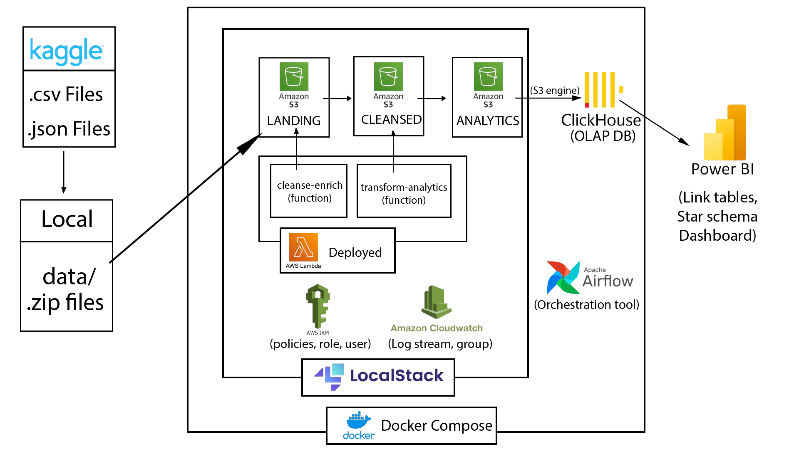
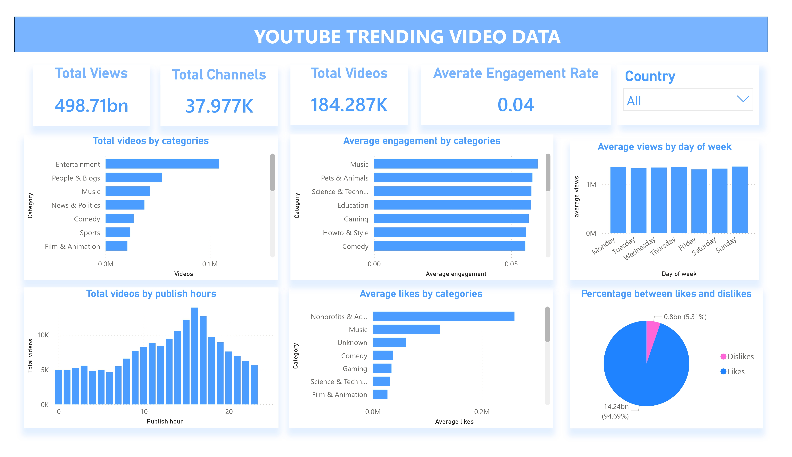

# 📊 YouTube Trending Analytics Engineering Project

This project builds a comprehensive **Data Pipeline (ELT/ETL)** to collect, clean, enrich, transform, analyze, and visualize the **Trending YouTube Video Statistics** dataset from Kaggle.

The system is designed to simulate a cloud environment locally using **LocalStack** (S3, Lambda, IAM, CloudWatch), orchestrate the pipeline workflow using **Apache Airflow**, store large-scale analytical data in a high-performance columnar database using **ClickHouse OLAP**, and build interactive visualizations using **PowerBI**.

---

## 🏗️ System Architecture



---

## 🛠️ Technology Stack

*   **Cloud Emulation**: Docker & Docker Compose, LocalStack (S3, Lambda, IAM, CloudWatch)
*   **Orchestration**: Apache Airflow (invokes Lambda functions on LocalStack via AWS SDK/boto3)
*   **3-Tier Data Lake**:
    1.  `yt-landing-bucket`: Stores raw CSV and JSON files uploaded from local storage.
    2.  `yt-cleansed-bucket`: Cleaned, timezone-normalized, and schema-validated Parquet data partitioned by `country`.
    3.  `yt-analytics-bucket`: Analytical Star Schema datasets ready for query integration.
*   **OLAP Database**: ClickHouse utilizing `S3 Engine` to query S3 Parquet files directly without copying data.
*   **Business Intelligence**: PowerBI Desktop connected to ClickHouse Server using Star Schema design.

---

## 📂 Project Directory Structure

```markdown
aws_youtube_analytics/
├── docker-compose.yaml              # Multi-container orchestration (LocalStack, ClickHouse, Airflow)
├── .env                             # Environment variable configurations
├── plan.md                          # Comprehensive project implementation plan
├── README.md                        # Documentation and guides (this file)
├── requirements.txt                 # WSL Python environment dependencies
├── data/                            # Raw data folder (gitignored)
│   └── raw/                         # Copy downloaded Kaggle CSV & JSON datasets here
├── localstack/
│   └── init/                        # Initialization scripts run by LocalStack on startup
│       ├── 01-create-buckets.sh     # S3 bucket definitions
│       ├── 02-setup-iam.sh          # IAM Roles and Policies
│       ├── 03-setup-cloudwatch.sh   # CloudWatch log groups creation
│       └── 04-deploy-lambdas.sh     # Automates Lambda packaging and registration
├── lambdas/                         # AWS Lambda functions source code
│   ├── cleanse_enrich/              # Cleans and normalizes raw dataset to Parquet
│   └── transform_analytics/         # Aggregates datasets into a Star Schema
├── scripts/
│   ├── build_lambdas.sh             # Compiles dependencies compatible with AWS Linux
│   └── upload_to_landing.py         # Python script to load local raw files to S3
├── airflow/
│   └── youtube_analytics_dag.py     # Airflow DAG defining pipeline flow
├── powerbi/
│   └── youtube_analytics.pbix       # Completed PowerBI Report template
└── images/
    └── dashboard.jpg                # PowerBI dashboard screenshot preview
```

---

## 🚀 Setup & Execution Guide

### Step 1: Prerequisites
1.  **OS**: Windows 10/11 with **WSL2 (Ubuntu)** active.
2.  **Docker & Docker Desktop**: Installed and integrated with WSL2.
3.  **Python 3.10**: Configured inside WSL2 for building lambda modules.
4.  **Zip and Build Tools** inside WSL2:
    ```bash
    sudo apt-get update && sudo apt-get install -y zip unzip build-essential
    ```
5.  **PowerBI Desktop** installed on your host Windows machine.

### Step 2: Download the Raw Dataset
1.  Go to the Kaggle dataset page: [Trending YouTube Video Statistics](https://www.kaggle.com/datasets/datasnaek/youtube-new).
2.  Download the ZIP file and extract it.
3.  Create a directory named `data/raw` in the root folder of the project.
4.  Copy the `.csv` and `.json` files of the 10 countries (CA, DE, FR, GB, IN, JP, KR, MX, RU, US) into `data/raw/`.

### Step 3: Package AWS Lambda Functions
Compile the lambda packages and dependencies to ensure compatibility with AWS Lambda's Amazon Linux environment:
```bash
# Set execution permission and run the script
chmod +x scripts/build_lambdas.sh
./scripts/build_lambdas.sh
```
This script creates two optimized `.zip` archives (under 250MB unzipped size limit by stripping caches, test logs, and unused binaries):
*   `lambdas/cleanse_enrich/lambda_cleanse_enrich.zip`
*   `lambdas/transform_analytics/lambda_transform_analytics.zip`

### Step 4: Boot Infrastructure via Docker Compose
Launch LocalStack, ClickHouse, PostgreSQL (Airflow metadata database), and Apache Airflow containers:
```bash
docker-compose up -d
```
> [!NOTE]
> During the initial startup, LocalStack takes about 1-2 minutes to execute initialization shell scripts, configure S3 buckets/IAM privileges, and register Lambda functions from the S3 deployment paths.

### Step 5: Trigger the Pipeline in Apache Airflow
1.  Open your browser and navigate to the Airflow UI: [http://localhost:8080](http://localhost:8080).
2.  Log in using default credentials:
    *   **Username**: `admin`
    *   **Password**: `admin`
3.  Unpause/Toggle the DAG **`youtube_trending_pipeline`**.
4.  Click the **Trigger DAG** (Play button on the top right) to run the pipeline.

**Pipeline Stage Execution:**
1.  **`upload_raw_to_landing`**: Scans `data/raw/` for CSV/JSON files and uploads them to `yt-landing-bucket`.
2.  **`invoke_cleanse_enrich_XX`** *(10 parallel tasks)*: Calls Lambda function `cleanse-enrich` to read the raw files, parse/fix Japanese/Korean encoding errors, normalize publish times, join category mappings, and output partition-optimized Parquet to `yt-cleansed-bucket`.
3.  **`invoke_transform_analytics`**: Waits for all cleansing tasks, then triggers the second Lambda function `transform-analytics` to assemble the Star Schema facts and aggregations inside `yt-analytics-bucket`.

### Step 6: Validate ClickHouse Integration
Once Airflow marks all tasks as successful, the analytics files on S3 are mapped to ClickHouse tables. Access ClickHouse CLI to inspect records:
```bash
docker exec -it clickhouse clickhouse-client -d youtube_analytics --password clickhouse123
```
Run an SQL query to verify target records:
```sql
SELECT count() FROM fact_trending_videos;
```

---

## 📊 PowerBI Dashboard Setup

The PowerBI layout is modeled as a classic **Star Schema** utilizing the `dim_country` dimension table as a centralized filter node across 4 fact and aggregate tables:
*   `fact_trending_videos` (Detailed trending records)
*   `agg_category_stats` (Performance summaries grouped by category)
*   `agg_channel_performance` (Channel analytics)
*   `agg_time_analysis` (Trending time delays and hour charts)

### Configure Connection Settings
1.  Open **PowerBI Desktop** on Windows.
2.  Load the pre-built project report: `powerbi/youtube_analytics.pbix`.
3.  If prompted to authenticate or update data source configurations, specify:
    *   **Connection Type**: **Database** -> **ClickHouse** or **ODBC** / **Web (HTTP API)**.
    *   **Host URL**: `http://127.0.0.1:8123` (Pointed at the exposed ClickHouse HTTP port on your local host).
    *   **Database**: `youtube_analytics`
    *   **User**: `default`
    *   **Password**: `clickhouse123`
4.  Click **Refresh** to import the records into the report graphs.

### Data Modeling Relationships
Tables are joined in a **1-to-many (1:*)** layout using the `country` key. Cross filter direction is configured to **Single** (from dimension to fact tables) to guarantee high performance and proper query planning.

### Dashboard Preview
Here is a snapshot of the integrated visual dashboard:



---

## 📝 Key Insights Visualized
*   **Trending Metrics**: Total trending entries, total view counts, like ratios, and comments.
*   **Engagement Rate & Like Ratio**: User interaction behaviors mapped across distinct video categories and geographical locations.
*   **Time-to-Trend Duration**: Metrics indicating the delay (in days) between the initial publish time and when the video officially entered the trending list.
*   **Top Channels & Categories**: Ranks for highest performing channels and most popular topics in each country.
